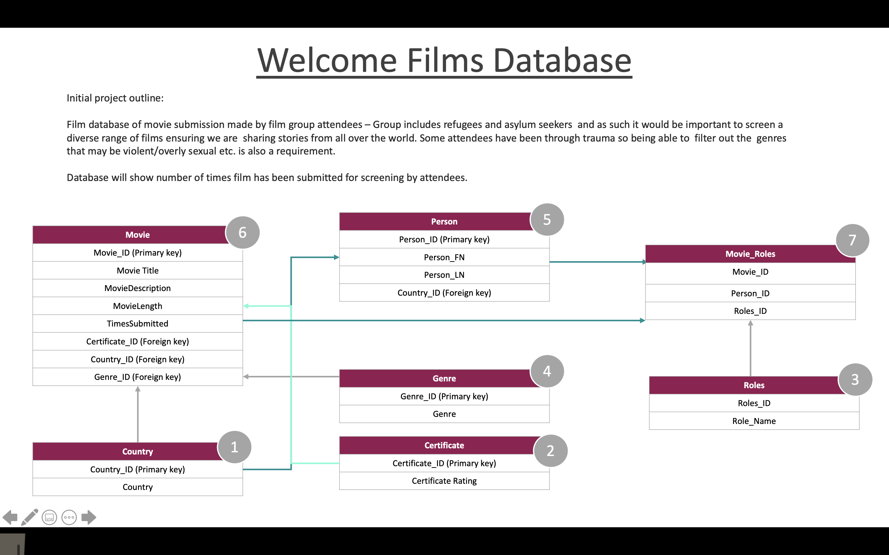
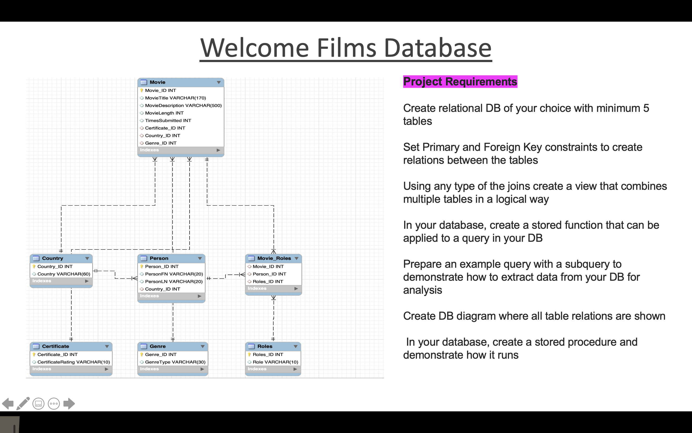
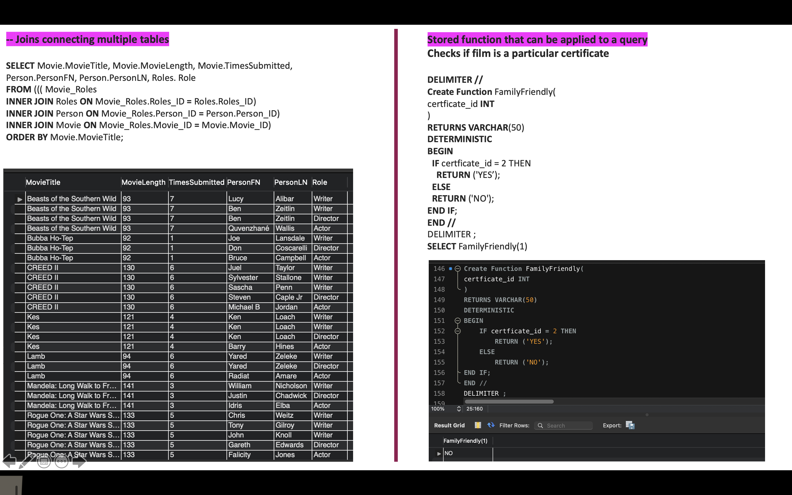

# CFG_MySQL_PROJECT

## Initial project idea, database and table design, setting Primary and Foreign Key constraints to create relations between tables and keeping in mind normalisation whilst structuring the database. :woman_technologist: :thought_balloon:

## Final DB diagram with all table relations shown. Project pass requirements listed :white_check_mark:  

## Joins connecting multiple tables. Stored function that can be applied to a query :white_check_mark:

## Example query with a subquery. Stored procedure :white_check_mark:  

